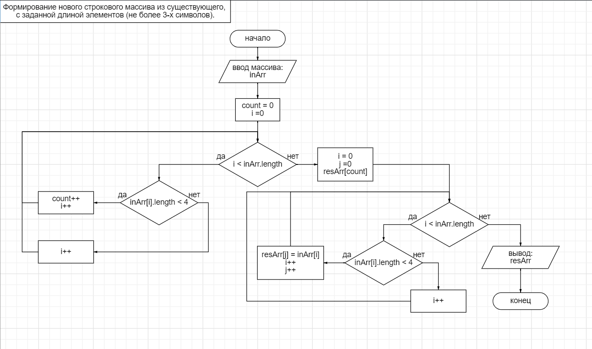

# Итоговая контрольная работа

## 1.  Задание

// Написать программу, которая из имеющегося массива строк формирует новый массив из строк, длина которых меньше, либо равна 3 символам. Первоначальный массив можно ввести с клавиатуры, либо задать на старте выполнения алгоритма. При решении не рекомендуется пользоваться коллекциями, лучше обойтись исключительно массивами.
## 2. Блок-схема

## 3. Описание программы
### - Старт программы
* На старте программы вызов метода **_MyLine()_** позволяет пользователю задать размер исходного строкового массива. Этот метод формирует приглашение ко вводу значения с клавиатуры и возвращает его в основную программу.
### - Формирование исходного массива
* Согласно задания в программе формируется новый массив с количеством элементов задаваемым пользователем. Данное значение передается методу **_newArr()_** в качестве параметра.
* Для генерации элементов массива в методе *newArr* используется метод **_Random()_**.
Заполнение массива осуществляется при помощи цикла _FOR_.
### - Создание итогового массива
Для реализации этой задачи создан метод **_resArr()_**. см. Блок-схему п.2
В качестве параметра этот метод получает исходный строковый массив, а возвращает, массив с элементами отвечающими условию задания.
#### Формирование нового  массива осуществляется поэтапно:
* В первом цикле _FOR_ определяется количество элементов в исходном массиве отвечающим условиям задания. Это значение сохраняется в переменной _count_.
* Далее создается новый массив с размером, соответствующим значению _count_.
* С помощью повторного перебора исходного массива с применением того же условия заполняется новый массив.
### - Вывод массива на экран
Вывод массива осуществляется функцией **_WriteLine()_** с применением метода **_String.Join_**.